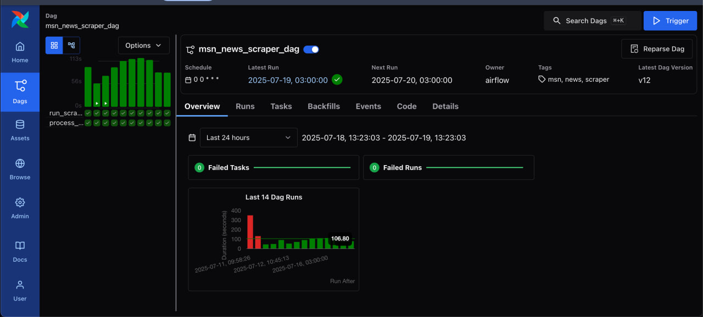

# MLOps Pipeline with Airflow and Scraper

## Overview

This project implements a complete MLOps pipeline with the following components:

1. **Scraper**: Collects articles from the MSN News API.
2. **Processor**: Cleans and deduplicates the scraped data.
3. **Airflow DAG (Astro)**: Orchestrates scraping and processing tasks automatically.

---

## Airflow & Astro

- The pipeline is managed and executed inside **Astro**, a managed Airflow platform. 
- The DAG runs within Astro and can be triggered or scheduled using the Astro UI or Astro CLI.
- Each run can be monitored and logs inspected from the Astro web interface.

The output filenames include timestamps and are set dynamically using environment variables.

**Astro Deployment:**  
You can view and manage the DAG via Astro here:  
[Open Astro Deployment](https://www.astronomer.io)

---

### Pipeline Steps

- The `scraper` task collects raw news articles and saves them as CSV files to Google Cloud Storage (GCS).
- The `processor` task downloads the CSV, cleans/deduplicates it, and saves the result back to GCS.
- Output filenames are timestamped and set via environment variables.

---

## Scraper

The scraper uses the MSN API to gather recent stories. Each record includes:
- `id`, `title`, `url`, `category`, `publishedDateTime`

The scraper saves the results to a CSV file and uploads it to GCS using the `upload_df_to_gcs()` function from the Google Cloud Storage SDK.

---

## Processor

The processor script:
- Downloads the raw CSV file from GCS
- Cleans and deduplicates the data
- Saves the cleaned file back to GCS

---

## DAG Monitoring in Astro

Below is a screenshot showing the Airflow DAG running in the Astro UI:

---